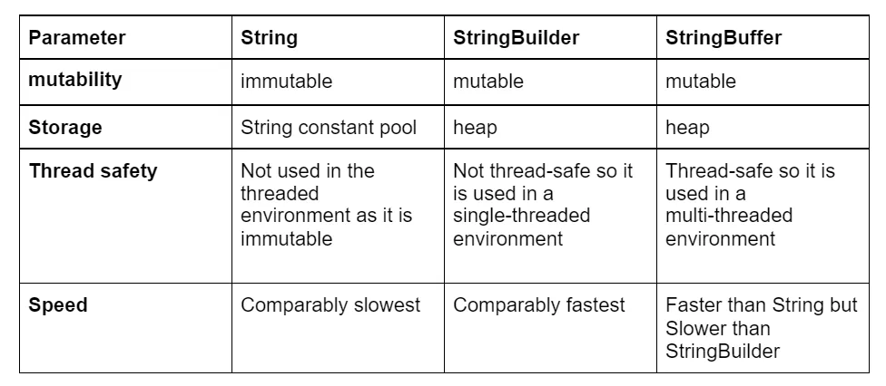

# Java-Knowledge

## Static Keyword
When you declare a variable or a method as static, it belongs to the class, rather than a specific instance. This means that only one instance of a static member exists, even if you create multiple objects of the class, or if you don’t create any. It will be shared by all objects.

### Static Variables

```java
public class Counter {
  public static int COUNT = 0;
  Counter() {
    COUNT++;
  }
}
```

The COUNT variable will be shared by all objects of that class. When we create objects of our Counter class in main, and access the static variable.

```java
public class MyClass {
  public static void main(String[] args) {
    Counter c1 = new Counter();
    Counter c2 = new Counter();
    System.out.println(Counter.COUNT);
  }
}
// Outputs "2"
```


### Static Methods
It is used for altering static contents of the class. There are some restrictions of static methods :

1. Static method can not use non-static members (variables or functions) of the class.
2. Static method can not use this or super keywords.

```java
public class Counter {
  public static int COUNT = 0;
  Counter() {
    COUNT++;
  }

  public static void increment(){
    COUNT++;
  }
}
```

Static methods can also be called from instance of the class.

```java
public class MyClass {
  public static void main(String[] args) {
    Counter.increment();
    Counter.increment();
    System.out.println(Counter.COUNT);
  }
}
// Outputs "2"
```

### Static Blocks
Static code blocks are used to initialise static variables. These blocks are executed immediately after declaration of static variables.

```java
public class Saturn {
  public static final int MOON_COUNT;

  static {
    MOON_COUNT = 62;
  }
}

public class Main {
  public static void main(String[] args) {
    System.out.println(Saturn.MOON_COUNT);
  }
}
// Outputs "62"
```


### Static Nested Classes
A class can have static nested class which can be accessed by using outer class name.


```java
public class Outer {

  public Outer() {
  }

  public static class Inner {
    public Inner() {
    }
  }
}
```
In above example, class Inner can be directly accessed as a static member of class Outer.

```java
public class Main {
  public static void main(String[] args) {
    Outer.Inner inner = new Outer.Inner();
  }
}
```

One of the use case of static nested classes in Builder Pattern popularly used in java.


## Final Keyword
Final keyword is a non-access modifier used for classes, attributes & methods, which makes them non-changeable (impossible to inherit/reassign/override).

### Classes 
Classes marked as final cannot be extended (inherited).

### Variables
Variables marked as final connot be reassigned.

### Methods
Methods marked as final cannot be overriden.


## Threading
Allows us to do multiple things at once.
When multiple threads are executed at the same time. Then it is called as multi-threading.

### Multitasking in Java
They are of two type:-
1. Processed-bases multitasking: This type is heavy and requires a lot of time. This is because the program takes a lot of time to switch between differenct processes.

2. Thread-based multitasking: These are light-weight and require short time to switch between the processes.

### Thread life-cycle
A thread always remains in one of the few states.
The thread model consists of various states.

1. New: The model is in the new state when the code is not yet running.
2. Running stage or active stage: This is the state when the program is under execution or in ready to execute stage.
3. Suspended Stage: This is the state when the process is paused (temporarily) due to some reasons.
4. Blocked Stage: This is the state when thread is waiting for some resources. In the blocked state, the thread scheduler clears the queue by rejecting unwanted threads which are present.
5. Terminated Stage: This state stops a thread's execution immediately. A terminated thread means that it is dead and is no longer available for use.

## String, StringBuffer, StringBuilder



Here are detailed answers to each of the Java Spring Boot interview questions:

### **Core Java**

1. **Explain the difference between `==` and `equals()` in Java.**
   - **`==`**: This operator is used to compare primitive data types and object references. When used with objects, it checks whether both references point to the same memory location.
   - **`equals()`**: This method, defined in the `Object` class, is used to compare the contents of two objects for equality. Many classes (like `String`, `Integer`, etc.) override this method to provide a meaningful comparison of the actual data within objects.

   ```java
   String str1 = new String("Hello");
   String str2 = new String("Hello");

   System.out.println(str1 == str2);       // false, because they are different objects
   System.out.println(str1.equals(str2));  // true, because their contents are the same
   ```

2. **What are the main differences between an abstract class and an interface?**
   - **Abstract Class**:
     - Can have both abstract methods (without implementation) and concrete methods (with implementation).
     - Can have constructors.
     - Can have state (instance variables).
     - A class can inherit only one abstract class.
   - **Interface**:
     - All methods are abstract by default (until Java 8, when default and static methods were introduced).
     - Cannot have constructors.
     - Cannot maintain state (no instance variables, only constants).
     - A class can implement multiple interfaces.

   ```java
   abstract class Animal {
       abstract void sound();
       void eat() {
           System.out.println("Eating...");
       }
   }

   interface Movable {
       void move();
   }

   class Dog extends Animal implements Movable {
       void sound() {
           System.out.println("Barks");
       }
       public void move() {
           System.out.println("Runs");
       }
   }
   ```

3. **What is the Java Memory Model (JMM), and how does it relate to concurrency?**
   - The **Java Memory Model (JMM)** defines how threads interact through memory and what behaviors are allowed in concurrent execution. It specifies when a thread's write to a variable is visible to another thread. The JMM guarantees *visibility* (changes made by one thread are visible to others) and *ordering* (operations happen in the correct order). Key concepts include *volatile*, *synchronized blocks*, and the *happens-before* relationship, which ensures that memory writes by one specific statement are visible to another specific statement.

4. **How do you prevent a class from being subclassed in Java?**
   - To prevent a class from being subclassed, declare the class as `final`. A `final` class cannot be extended by any other class.

   ```java
   public final class MyClass {
       // class body
   }
   ```

5. **What is a `volatile` keyword in Java?**
   - The `volatile` keyword is used with variables to ensure that their values are always read from and written to the main memory. This prevents threads from caching variables locally, ensuring visibility of the latest values across all threads.

   ```java
   private volatile boolean flag = true;
   ```

6. **Explain the concept of `StringBuilder` vs. `StringBuffer` and when you would use each.**
   - Both `StringBuilder` and `StringBuffer` are used to create mutable strings (strings that can be changed after creation).
     - **`StringBuffer`**: Synchronized, thread-safe, and slower.
     - **`StringBuilder`**: Not synchronized, not thread-safe, and faster. 
   - **Usage**: Use `StringBuffer` in multithreaded environments where thread safety is required. Use `StringBuilder` in single-threaded environments for better performance.

7. **What is the purpose of the `transient` keyword?**
   - The `transient` keyword is used in serialization. Fields marked as `transient` are not included in the serialization process. This is useful for fields that are not part of the object's persistent state, such as temporary or sensitive information.

   ```java
   class Employee implements Serializable {
       private String name;
       private transient int age;
   }
   ```

### **Spring & Spring Boot**

1. **What is Spring Boot, and how is it different from the traditional Spring framework?**
   - **Spring Boot** is a framework built on top of the traditional Spring framework that simplifies the setup, development, and deployment of new Spring applications. It provides:
     - **Auto-configuration**: Automatically configures your Spring application based on the dependencies you have.
     - **Standalone applications**: No need for a web server, as Spring Boot can package your application with an embedded server like Tomcat or Jetty.
     - **Opinionated defaults**: Sensible defaults and configurations are provided out of the box, reducing the need for boilerplate code.
     - **Spring Boot Starters**: Pre-configured templates for different technologies like JPA, Web, Security, etc.

2. **How does Spring Boot's auto-configuration work? Can you explain it with an example?**
   - Spring Boot's **auto-configuration** works by scanning the classpath and applying configurations based on what it finds. It uses conditional annotations like `@ConditionalOnClass`, `@ConditionalOnMissingBean`, etc., to apply these configurations only if certain conditions are met.

   **Example**: If you have `spring-boot-starter-data-jpa` in your dependencies, Spring Boot will automatically configure a `DataSource`, an `EntityManagerFactory`, and a `TransactionManager`.

   ```java
   @SpringBootApplication
   public class MyApplication {
       public static void main(String[] args) {
           SpringApplication.run(MyApplication.class, args);
       }
   }
   ```

3. **What are Spring Boot starters, and why are they important?**
   - **Spring Boot Starters** are pre-configured dependency packages that simplify the process of adding dependencies and configurations to your Spring Boot application. For example, `spring-boot-starter-web` includes dependencies for building web applications (Spring MVC, Jackson, etc.). Starters reduce the complexity of managing multiple dependencies and ensure that they are compatible with each other.

   ```xml
   <dependency>
       <groupId>org.springframework.boot</groupId>
       <artifactId>spring-boot-starter-web</artifactId>
   </dependency>
   ```

4. **How do you implement exception handling in Spring Boot?**
   - Exception handling in Spring Boot can be implemented using `@ControllerAdvice` and `@ExceptionHandler` annotations. `@ControllerAdvice` is used to handle exceptions globally across the whole application, while `@ExceptionHandler` is used for specific exceptions in a controller.

   ```java
   @ControllerAdvice
   public class GlobalExceptionHandler {

       @ExceptionHandler(ResourceNotFoundException.class)
       public ResponseEntity<String> handleResourceNotFound(ResourceNotFoundException ex) {
           return new ResponseEntity<>(ex.getMessage(), HttpStatus.NOT_FOUND);
       }

       @ExceptionHandler(Exception.class)
       public ResponseEntity<String> handleGeneralException(Exception ex) {
           return new ResponseEntity<>(ex.getMessage(), HttpStatus.INTERNAL_SERVER_ERROR);
       }
   }
   ```

5. **What is the purpose of the `@SpringBootApplication` annotation?**
   - `@SpringBootApplication` is a convenience annotation that combines three annotations:
     - **`@SpringBootConfiguration`**: Indicates that the class is a source of bean definitions for the application context.
     - **`@EnableAutoConfiguration`**: Enables Spring Boot’s auto-configuration feature.
     - **`@ComponentScan`**: Scans for components, configurations, and services in the package where the application is located.

   ```java
   @SpringBootApplication
   public class MyApplication {
       public static void main(String[] args) {
           SpringApplication.run(MyApplication.class, args);
       }
   }
   ```

6. **Explain the difference between `@Component`, `@Service`, `@Repository`, and `@Controller`.**
   - All of these annotations are specializations of `@Component` and are used to indicate that a class is a Spring-managed bean:
     - **`@Component`**: A generic stereotype for any Spring-managed component.
     - **`@Service`**: Indicates that the class contains business logic. It is a specialization of `@Component` for service-layer components.
     - **`@Repository`**: Indicates that the class is a DAO (Data Access Object) component. It encapsulates storage, retrieval, and search behavior typically associated with a database.
     - **`@Controller`**: Indicates that the class serves as a controller in Spring MVC (used for handling web requests).

   ```java
   @Service
   public class MyService {
       // business logic
   }

   @Repository
   public class MyRepository {
       // data access logic
   }

   @Controller
   public class MyController {
       // request handling logic
   }
   ```

7. **How does dependency injection work in Spring Boot?**
   - **Dependency Injection (DI)** in Spring Boot allows for the injection of objects (dependencies) into other objects. This is achieved by using annotations like `@Autowired`, `@Inject`, or through constructor injection.
     - **Field Injection**:
       ```java
       @Autowired
       private MyService myService;
       ```
     - **Constructor Injection**:
       ```java
       private final MyService myService;

       @Autowired
       public MyComponent(MyService myService) {
           this.myService = myService;
       }
       ```
     -

 **Setter Injection**:
       ```java
       private MyService myService;

       @Autowired
       public void setMyService(MyService myService) {
           this.myService = myService;
       }
       ```

8. **What are Spring profiles, and how are they used in a Spring Boot application?**
   - **Spring Profiles** allow you to segregate parts of your application configuration and make it available only in certain environments (e.g., dev, test, prod). You can define beans and configurations specific to a profile and activate them by setting the `spring.profiles.active` property.

   **Usage**:
   ```java
   @Configuration
   @Profile("dev")
   public class DevConfig {
       // beans for development profile
   }
   ```

   **Activating a Profile**:
   - In `application.properties`:
     ```properties
     spring.profiles.active=dev
     ```

   - Via command-line:
     ```bash
     java -jar myapp.jar --spring.profiles.active=prod
     ```

9. **How do you externalize configuration in Spring Boot? Discuss the use of `application.properties` or `application.yml`.**
   - In Spring Boot, configurations can be externalized using `application.properties` or `application.yml` files. These files allow you to define configuration properties that can be easily changed without modifying the code.
   - **`application.properties`**:
     ```properties
     server.port=8081
     spring.datasource.url=jdbc:mysql://localhost:3306/mydb
     ```
   - **`application.yml`**:
     ```yaml
     server:
       port: 8081
     spring:
       datasource:
         url: jdbc:mysql://localhost:3306/mydb
     ```

   - **Loading Configuration**:
     - Spring Boot automatically loads these files and binds the properties to `@ConfigurationProperties` annotated classes or `@Value` annotations.

10. **What is a `Bean` in Spring, and how do you define one?**
    - In Spring, a **Bean** is an object that is managed by the Spring IoC (Inversion of Control) container. Beans are created, configured, and managed by Spring, and they can be injected into other beans.
    - **Defining a Bean**:
      - Using `@Component`, `@Service`, `@Repository`, or `@Controller` annotations:
      ```java
      @Component
      public class MyBean {
          // bean logic
      }
      ```
      - Using `@Bean` in a `@Configuration` class:
      ```java
      @Configuration
      public class AppConfig {
          @Bean
          public MyBean myBean() {
              return new MyBean();
          }
      }
      ```

### **Spring Data & JPA**

1. **What is Spring Data JPA, and how does it simplify database interactions?**
   - **Spring Data JPA** is a part of the larger Spring Data family that simplifies data access using JPA (Java Persistence API). It provides a higher-level abstraction over JPA, reducing boilerplate code like entity management, transaction management, and query execution.
   - **Benefits**:
     - Automatic implementation of CRUD operations through repository interfaces.
     - Derived query methods: Methods with query derivation by parsing method names.
     - Pagination and sorting support.

2. **Explain the difference between `CrudRepository`, `JpaRepository`, and `PagingAndSortingRepository`.**
   - **`CrudRepository`**: Provides CRUD (Create, Read, Update, Delete) functionalities.
   - **`PagingAndSortingRepository`**: Extends `CrudRepository` and adds methods for pagination and sorting.
   - **`JpaRepository`**: Extends `PagingAndSortingRepository` and provides JPA-specific functionalities, such as flushing the persistence context and deleting records in batches.

   ```java
   public interface MyRepository extends JpaRepository<MyEntity, Long> {
       // custom query methods
   }
   ```

3. **How would you implement pagination and sorting in a Spring Boot application?**
   - Pagination and sorting can be implemented using the `Pageable` and `Sort` interfaces provided by Spring Data JPA.

   **Example**:
   ```java
   public interface MyRepository extends JpaRepository<MyEntity, Long> {
       Page<MyEntity> findAll(Pageable pageable);
   }

   // Usage in Service
   Pageable pageable = PageRequest.of(0, 10, Sort.by("name"));
   Page<MyEntity> page = myRepository.findAll(pageable);
   ```

4. **What are the different fetching strategies in JPA/Hibernate?**
   - **Fetching strategies** determine how related entities are loaded:
     - **EAGER**: Related entities are loaded immediately when the parent entity is loaded.
     - **LAZY**: Related entities are loaded only when they are accessed for the first time.

   ```java
   @Entity
   public class Order {
       @ManyToOne(fetch = FetchType.LAZY)
       private Customer customer;
   }
   ```

5. **Explain the `@Transactional` annotation and its usage in Spring.**
   - **`@Transactional`** is used to define the scope of a single database transaction. It can be applied at the class or method level to manage transaction boundaries. Spring will automatically start a transaction before the method execution and commit or rollback based on the outcome.

   ```java
   @Service
   public class MyService {

       @Transactional
       public void performTransaction() {
           // transactional code
       }
   }
   ```

6. **How do you handle N+1 select issues in JPA?**
   - The N+1 select problem occurs when JPA executes one query to retrieve a parent entity and then N additional queries to retrieve each associated child entity.
   - **Solution**:
     - Use **fetch joins** to load associations eagerly.
     - Optimize queries with `@EntityGraph` or Hibernate-specific annotations like `@BatchSize`.

   ```java
   @Query("SELECT o FROM Order o JOIN FETCH o.customer WHERE o.id = :id")
   Order findByIdWithCustomer(@Param("id") Long id);
   ```

### **Microservices & REST**

1. **How do you create a RESTful web service in Spring Boot?**
   - To create a RESTful web service, annotate a class with `@RestController` and define request mapping methods using `@RequestMapping` or `@GetMapping`, `@PostMapping`, etc.

   ```java
   @RestController
   @RequestMapping("/api")
   public class MyController {

       @GetMapping("/hello")
       public String sayHello() {
           return "Hello, World!";
       }
   }
   ```

2. **What is the significance of `@RestController` in Spring Boot?**
   - `@RestController` is a convenience annotation that combines `@Controller` and `@ResponseBody`. It indicates that the class is a controller where `@RequestMapping` methods assume `@ResponseBody` semantics by default, i.e., the methods return data rather than view names.

   ```java
   @RestController
   public class MyController {
       @GetMapping("/data")
       public MyData getData() {
           return new MyData();
       }
   }
   ```

3. **How do you secure a Spring Boot application? Discuss authentication and authorization mechanisms.**
   - Spring Boot applications can be secured using **Spring Security**. You can configure security for both authentication (who can log in) and authorization (who can access what).
     - **Authentication**: Can be done via in-memory, JDBC-based, LDAP, OAuth2, etc.
     - **Authorization**: Roles and permissions can be defined using method-level annotations like `@PreAuthorize`, `@Secured`, or through configuration.

   **Example**:
   ```java
   @Configuration
   @EnableWebSecurity
   public class SecurityConfig extends WebSecurityConfigurerAdapter {
       @Override
       protected void configure(HttpSecurity http) throws Exception {
           http
               .authorizeRequests()
               .antMatchers("/admin/**").hasRole("ADMIN")
               .antMatchers("/user/**").hasRole("USER")
               .antMatchers("/", "/home").permitAll()
               .and()
               .formLogin();
       }
   }
   ```

4. **What are some ways to implement inter-service communication in a microservices architecture?**
   - **Inter-service communication** can be implemented using:
     - **REST APIs**: Services communicate over HTTP/HTTPS using RESTful endpoints.
     - **gRPC**: A high-performance RPC framework that uses Protocol Buffers.
     - **Message Queues**: Asynchronous communication using messaging systems like RabbitMQ, Kafka.
     - **Feign Client**: Declarative REST client in Spring Cloud that simplifies HTTP API calls.

   ```java
   @FeignClient(name = "user-service")
   public interface UserServiceClient {
       @GetMapping("/users/{id}")
       User getUserById(@PathVariable("id") Long id);
   }
   ```

5. **Explain the role of `FeignClient` in Spring Cloud.**
   - `FeignClient` is a declarative web service client in Spring Cloud that simplifies the process of making HTTP calls to other services. It integrates with Ribbon (for client-side load balancing) and Hystrix (for circuit breaker patterns).

   ```java
   @FeignClient(name = "user-service", fallback = UserServiceFallback.class)
   public interface UserServiceClient {
       @GetMapping("/users/{id}")
       User getUserById(@PathVariable("id") Long id);
   }
   ```

6. **How do you implement circuit breaker patterns in a Spring Boot application?**
   - Circuit breakers in Spring

 Boot can be implemented using **Resilience4j** or **Hystrix**. These libraries help to prevent cascading failures in microservices by stopping the flow of requests to a failing service.

   **Resilience4j Example**:
   ```java
   @Service
   public class MyService {

       @CircuitBreaker(name = "myService", fallbackMethod = "fallback")
       public String callRemoteService() {
           // call remote service
       }

       public String fallback(Throwable throwable) {
           return "Fallback response";
       }
   }
   ```

These questions and answers should provide a comprehensive overview and preparation for a Java Spring Boot interview for a developer with 3-5 years of experience.